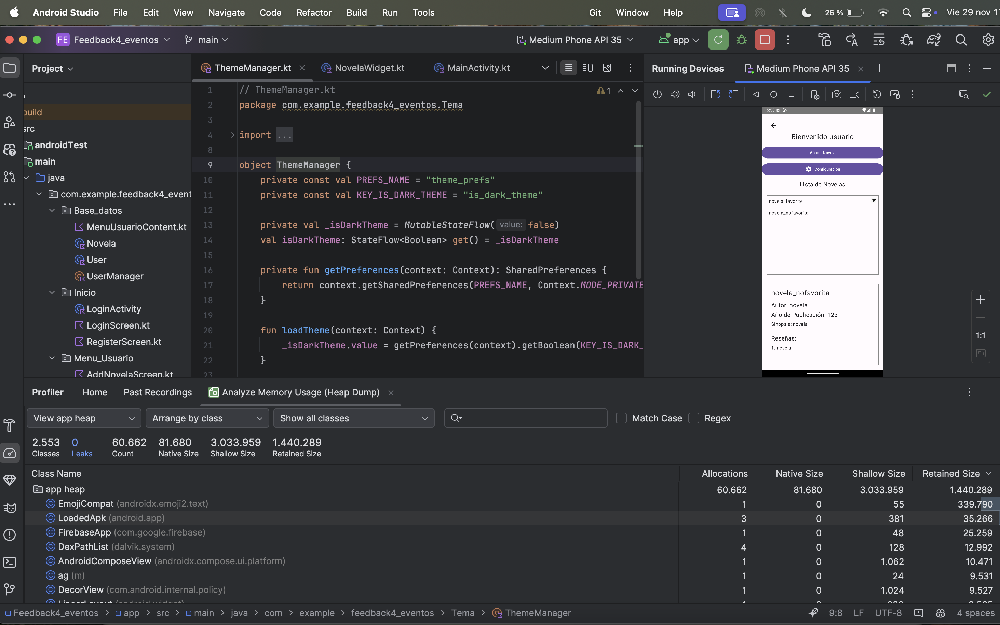
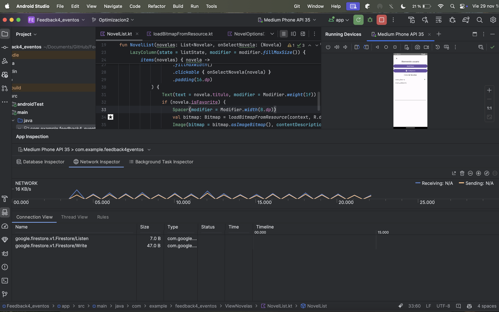

# Proyecto Feedback5

## Enlace al Repositorio

[Repositorio en GitHub](https://github.com/jmartter/Feedback4_eventos.git)

## Optimización del Uso de la Memoria

### Capturas del Memory Profiler

<table>
  <tr>
    <td></td>
    <td></td>
  </tr>
</table>

## Mejora del Rendimiento de la Red

### Captura del Network Profiler

<table>
  <tr>
    <td></td>
  </tr>
</table>

## Optimización del Uso de la Batería

Se ha optimizado el uso de la batería en la aplicación, aumentando el tiempo de la tasa de refresco del widget de 3 segundos a 30 minutos.