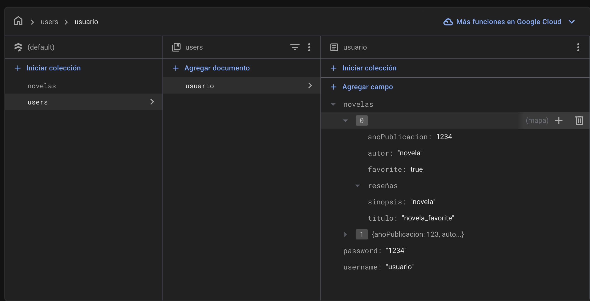
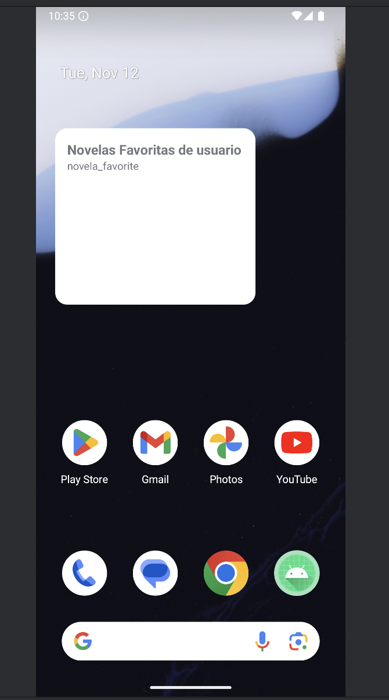
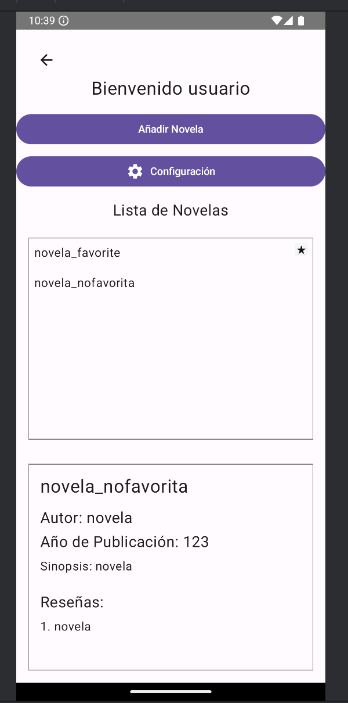

# Proyecto Feedback4

## Enlace al Repositorio

[Repositorio en GitHub](https://github.com/jmartter/Feedback4_eventos.git)

Este proyecto es una aplicación móvil desarrollada en Kotlin y Java, utilizando el framework Jetpack Compose para la interfaz de usuario y Gradle como sistema de construcción. La aplicación está diseñada para gestionar eventos y novelas, permitiendo a los usuarios registrarse, iniciar sesión, añadir novelas, ver detalles de novelas y gestionar sus preferencias.

## Características Principales

<table>
  <tr>
    <td></td>
    <td></td>
    <td></td>
  </tr>
</table>

- **Firebase Firestore**: La aplicación utiliza Firebase Firestore para la gestión de datos, permitiendo almacenar y recuperar información de usuarios y novelas de manera eficiente y segura.

- **Widget de Favoritas**: Incorpora un widget que permite a los usuarios ver rápidamente sus novelas favoritas directamente desde la pantalla principal de su dispositivo.

- **Menú Interactivo**: La aplicación cuenta con un menú interactivo que facilita la navegación entre diferentes secciones, como agregar una nueva novela, ver la lista de novelas del usuario y acceder a la configuración de la aplicación.

## Funcionalidades

- **Registro e Inicio de Sesión**: Los usuarios pueden crear una cuenta nueva o iniciar sesión con una cuenta existente.
- **Gestión de Novelas**: Los usuarios pueden añadir nuevas novelas, ver detalles de las novelas existentes, marcar novelas como favoritas y añadir reseñas.
- **Configuración de Tema**: Los usuarios pueden cambiar entre temas claro y oscuro según su preferencia.
- **Interfaz de Usuario Intuitiva**: La aplicación utiliza Jetpack Compose para ofrecer una experiencia de usuario fluida y moderna.

Este proyecto está diseñado para ofrecer una experiencia completa y personalizada a los usuarios, facilitando la gestión de sus novelas y preferencias de manera eficiente.

Este proyecto está compuesto por varias clases que se encargan de diferentes funcionalidades dentro de la aplicación. A continuación, se describen las clases principales y su funcionamiento:

## Clases Principales

### `LoginScreen.kt`
- **Descripción**: Componente de la interfaz de usuario para la pantalla de inicio de sesión.
- **Funcionalidad**: Permite a los usuarios ingresar su nombre de usuario y contraseña para iniciar sesión en la aplicación.

### `RegisterScreen.kt`
- **Descripción**: Componente de la interfaz de usuario para la pantalla de registro.
- **Funcionalidad**: Permite a los nuevos usuarios crear una cuenta proporcionando un nombre de usuario y una contraseña.

### `MenuUsuarioContent.kt`
- **Descripción**: Componente que gestiona el contenido del menú del usuario.
- **Funcionalidad**: Permite al usuario navegar entre diferentes pantallas como agregar una novela, ver novelas del usuario y configuración.

### `Novela.kt`
- **Descripción**: Clase de datos que representa una novela.
- **Funcionalidad**: Contiene información sobre una novela, como título, autor, año de publicación, sinopsis, si es favorita y reseñas.

### `User.kt`
- **Descripción**: Clase de datos que representa un usuario.
- **Funcionalidad**: Contiene información sobre un usuario, como nombre de usuario, contraseña y una lista de novelas.

### `MainActivity.kt`
- **Descripción**: Actividad principal de la aplicación.
- **Funcionalidad**: Inicializa Firestore y redirige a la actividad de inicio de sesión.

### `NovelList.kt`
- **Descripción**: Componente de la interfaz de usuario para la lista de novelas.
- **Funcionalidad**: Muestra una lista de novelas y permite seleccionar una novela para ver más detalles.

### `NovelOptionsDialog.kt`
- **Descripción**: Componente de la interfaz de usuario para el diálogo de opciones de novela.
- **Funcionalidad**: Permite al usuario ver, borrar, añadir a favoritos y añadir reseñas a una novela.

### `ViewNovelaDetailScreen.kt`
- **Descripción**: Componente de la interfaz de usuario para ver los detalles de una novela.
- **Funcionalidad**: Muestra información detallada sobre una novela seleccionada.

### `ViewNovelasScreen.kt`
- **Descripción**: Componente de la interfaz de usuario para ver la lista de novelas del usuario.
- **Funcionalidad**: Permite al usuario ver y gestionar sus novelas.

### `ThemeManager.kt`
- **Descripción**: Objeto que gestiona el tema de la aplicación.
- **Funcionalidad**: Permite cambiar entre temas claro y oscuro.

### `AddNovelaScreen.kt`
- **Descripción**: Componente de la interfaz de usuario para añadir una nueva novela.
- **Funcionalidad**: Permite al usuario añadir una nueva novela proporcionando título, autor, año de publicación y sinopsis.

### `ConfiguracionScreen.kt`
- **Descripción**: Componente de la interfaz de usuario para la configuración.
- **Funcionalidad**: Permite al usuario cambiar la configuración de la aplicación, como el tema.

### `MenuUsuarioActivity.kt`
- **Descripción**: Actividad que gestiona el menú del usuario.
- **Funcionalidad**: Carga el tema y muestra el contenido del menú del usuario.

### `MenuUsuarioScreen.kt`
- **Descripción**: Componente de la interfaz de usuario para el menú del usuario.
- **Funcionalidad**: Permite al usuario navegar entre diferentes opciones como añadir novela, ver novelas y configuración.

### `LoginActivity.kt`
- **Descripción**: Actividad de inicio de sesión.
- **Funcionalidad**: Gestiona el inicio de sesión y el registro de usuarios.

### `UserManager.kt`
- **Descripción**: Objeto que gestiona las operaciones relacionadas con los usuarios.
- **Funcionalidad**: Permite registrar usuarios, obtener usuarios, añadir novelas a usuarios, eliminar novelas de usuarios, gestionar favoritos y añadir reseñas.